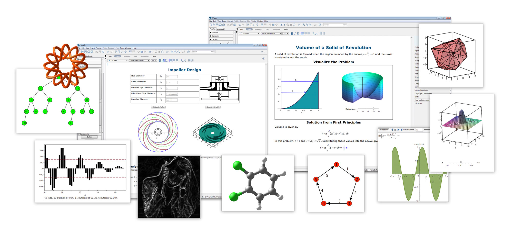

# Mathematical Software
Repository for RMUTT 09114202: โปรแกรมสำเร็จรูปทางคณิตศาสตร์ (Mathematical Software)

Lecturer: Ratthaprom Promkam, Dr.rer.nat

## คำอธิบายรายวิชา

การใช้งานโปรแกรมสำเร็จรูปทางคณิตศาสตร์ การใช้โปรแกรมสำเร็จรูปในการคำนวณเชิงเรขาคณิตและการคำนวณเชิงพีชคณิต รวมทั้งแคลคูลัสและสมการเชิงอนุพันธ์ การเขียนกราฟ การประยุกต์ใช้โปรแกรมสำเร็จรูปทางคณิตศาสตร์กับงานด้านต่าง ๆ

Mathematical package programs, using program tools in geometry and algebra including calculus and differential equation, implementation for graph drawing, applications of mathematical package programs in relates fields

## กำหนดการในชั้นเรียน

|Activity|  Date | Time | Location |
|--------|-------|------|----------|
|Lecture| Wednesday | 8.00 - 10.00 | ST1905 |
|Lab| Wednesday | 10.00 - 12.00 | ST1905 |
|Mid-Term Exam| Wednesday 19 JAN 2022 | 09.00 - 12.00 | ST1905 |
|Final Exam| Wednesday 30 APR 2022 | 09.00 - 12.00 | ST1905 |

## เอกสารประกอบการสอน

| Material | Topic | Download URL|
|----------|-------|---------------|
| Maple B1 | Demonstration | [Download](./materials/basic_1.pdf) |
| Maple B2 | Algebraic Manipulation | [Download](./materials/basic_2.pdf) |
| Maple B3 | Solving Equations | [Download](./materials/basic_3.pdf) |
| Maple Reference |  | [Download](./materials/reference.pdf) |

## ปฏิบัติการ

| LAB | Topic | Download URL |
|-----|-------------|--------------|
| LAB 01 | Introduction | [Problems](./materials/lab_01.pdf) and [Solutions](./materials/lab_sol_01.pdf) |
| LAB 02 | Solving Equations | [Problems](./materials/lab_02.pdf) and [Solutions](./materials/lab_sol_02.pdf) |
| LAB 03 | Plotting 1 | [Problems](./materials/lab_03.pdf)  |
| LAB 04 | Plotting 2 | [Problems](./materials/lab_04.pdf)  |

## Software and Installation Guide

1. [Maple 2020 - Setup](https://drive.google.com/file/d/11zvG-1iqSBToGiBIuauCx2MB2lU4t_Md/view): ไฟล์ติดตั้งโปรแกรม Maple 2020 บนระบบปฏิบัติการ Windows 10/11 แบบ 64Bit เท่านั้น (หลังจากดาวน์โหลดแล้วให้ทำการ Extract File ด้วย WinRAR หรือ 7-Zip)
2. [Setup Guide Video](https://www.youtube.com/watch?v=-lr35U6hyEw): วีดีโอแสดงวิธิการแครกโปรแกรมเพื่อใช้งาน Maple 2020 เวอร์ชันสมบูรณ์

## เอกสารอ้างอิง

1. Bernard V Liengme. (2019). Maple: A Primer (Concise Edition). OP Concise Physics.
2. Jonathan M. Borwein and Matthew P. Skerritt. (2011). An Introduction to Modern Mathematical Computing: With Maple. Springer: New York.
3. William P. Fox and William C. Bauldry. (2019). Advanced Problem Solving with Maple: A First Course. CRC Press.
4. Søren Eilers and Rune Johansen. (2017). Introduction to Experimental Mathematics. Cambridge University Press.
5. Ian Thompson. (2016). Understanding Maple. Cambridge University Press.